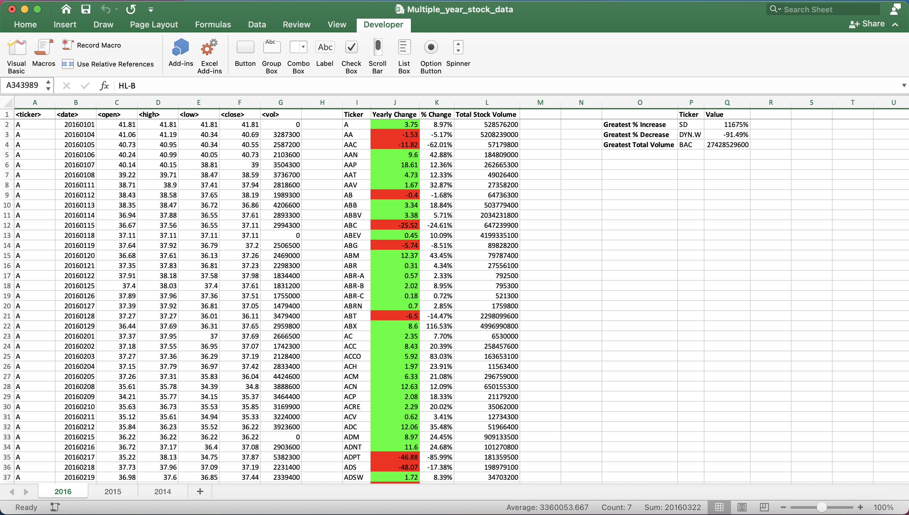

# Challenge: The VBA of Wall Street

## Outline
**Initial challenge:**

Use VBA scripting to analyze real stock market data to create a summary table showing: 
- the ticker symbol
- yearly change from the opening price at the beginning of the year and the closing price at the end of that same year 
- the total stock volume of the stock, 
- conditional formating to highlight the positive and negative changes, 

**Additional challenges:**

Use VBA scripting to create a second summary table showing the stock:
- with the greatest percent increse
- with the greatest percent decrease
- the greatest total volume

Additionally, ensure that the scripting runs identically on each sheet.

## Tech stack
- VBA

## Results
Successfully completed all chanllenges.

